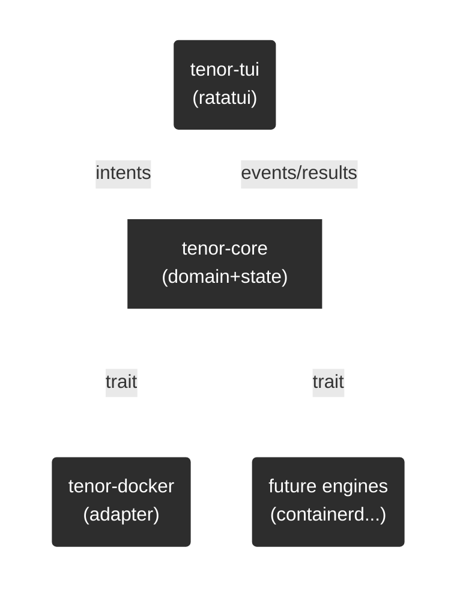

# Tenor Design Doc (v0.1 / MVP)

* Project: **tenor**（TUI Container Manager）
* Status: Draft
* Owners: you
* Last updated: 2026-01-03
* Target: **Docker Desktop 代替となる “よく使う範囲” をTUIで高品質に提供**（まずは dockerd 対応）

---

## 1. 背景

* Docker Desktopの有料化・商用条件が厳しく、代替の必要性がある。
* OrbStack は品質が高いが商用利用が有料。
* Rancher Desktop は環境によって挙動が不安定。
* よって **dockerd を操作する “高UI/UXのTUI”** を自作する。

---

## 2. 目的と成功指標

### 2.1 Goals（やること）

* Ratatui による **高品質TUI（UI/UXが最重要）**
* **dockerd**（Docker Engine API）をバックエンドとして操作できる
* 将来に向けて、バックエンド（コンテナエンジン）を差し替え可能な **抽象化** を最初から持つ
* Rust **cargo workspace** でパッケージ分割し、成長に耐える構造にする

### 2.2 Non-Goals（v0.1ではやらない）

* Kubernetes統合（Docker Desktopのk8s相当）
* GUI提供
* 独自コンテナランタイム実装（将来の話）
* Registryログイン・脆弱性スキャン等の周辺機能（必要が出たら）

### 2.3 Success Metrics（成功の測り方）

* 日常の操作が Tenor で完結する（少なくとも以下の8割）

  * コンテナ一覧/詳細/起動停止/再起動/削除
  * Logs追跡・検索
  * Execでシェルを開く
  * イメージ一覧/削除、pull
  * Stats（CPU/Mem/Net/IO）
* 操作が軽快：入力遅延を感じない（ローディング中もUIが固まらない）
* 例外時に壊れず、ユーザーに「次の行動」を示す

---

## 3. ユーザー像 / ユースケース

### 3.1 Persona

* ローカル/リモートでDockerを使う開発者
* Docker DesktopのGUIは不要だが「見やすい管理UI」は欲しい
* CLIは使えるが、状態把握（logs/stats/composeの稼働状況）がしんどい

### 3.2 Primary Use Cases（MVP）

1. コンテナ一覧を見て、状態（Up/Exited/Restarting）でフィルタ
2. コンテナを選択して logs を tail / pause / search
3. コンテナを start/stop/restart/delete
4. コンテナに exec で入る（sh/bash指定）
5. stats を見て重いコンテナを特定
6. images を一覧し、未使用イメージを削除、必要なら pull
7. volumes / networks を一覧し、不要なものを掃除

---

## 4. スコープ（機能要件）

### 4.1 機能（MVP）

* **Containers**

  * List (filters: status, name, label, project)
  * Inspect (summary/detail)
  * Start/Stop/Restart/Delete
  * Logs (tail/follow, since, timestamps, grep/search)
  * Exec (interactive)
* **Images**

  * List, Inspect, Remove, Pull
* **Volumes**

  * List, Inspect, Remove
* **Networks**

  * List, Inspect, Remove
* **Context / Connection**

  * Docker socket 接続（ローカル）
  * （要検討）docker context の簡易サポート or remote daemon

### 4.2 非機能要件

* UIは常に応答：IO待ちでフリーズしない
* エラーは握りつぶさない：ユーザーが復帰できるメッセージ
* 互換性：Docker Engine API の特定バージョン以上を対象（後述）

---

## 5. アーキテクチャ

### 5.1 全体構造（概念）

* UIは「状態（State）」を描画し、入力で「Intent」を発行
* Engine Adapter が Intent を Docker Engine API に変換し実行
* 結果は Domain Model に変換し State に反映

### 5.2 Cargo Workspace（提案）

* `tenor-core`

  * Domain model（Container/Image/Volume/Network）
  * Engine trait（抽象インターフェース）
  * State管理（UI state machine / reducer）
  * 共通Error型、イベント定義
* `tenor-docker`

  * Docker Engine API クライアント
  * core の Engine trait 実装（DockerEngine）
  * 変換層（API DTO ↔ Domain）
* `tenor-tui`

  * ratatui UI（画面/コンポーネント/キー割当）
  * input handling / focus management / routing
* `tenor-config`

  * 設定（ファイル、環境変数、プロファイル）
* `tenor-cli`（必要なら）

  * `tenor` 起動オプション、診断コマンドなど

---

## 6. Engine 抽象化（最重要）

### 6.1 ねらい

* UIは「Docker固有概念」を極力知らない
* coreが提供する操作（UseCase）に UI が依存する
* adapter が各バックエンド差分を吸収する

### 6.2 Domain Model（最小）

* `Container { id, name, image, state, status, created_at, labels, ports }`
* `Image { id, repo_tags, size, created_at }`
* `Volume { name, driver, mountpoint, labels }`
* `Network { id, name, driver, scope, internal }`

### 6.3 Engine Trait（例：方向性）

* `list_containers(filter) -> Vec<Container>`
* `inspect_container(id) -> ContainerDetail`
* `container_action(id, Start|Stop|Restart|Delete)`
* `stream_logs(id, options) -> LogStream`
* `exec(id, cmd, tty) -> InteractiveSession`
* `list_images`, `pull_image`, `remove_image`
* `list_volumes`, `remove_volume`
* `list_networks`, `remove_network`

※ この trait は **UIが欲しい操作**から逆算して決める（Docker APIの都合を持ち込まない）

---

## 7. UI/UX 仕様（MVP骨子）

### 7.1 画面構成（案）

* Top-level tabs:

  * `Containers` / `Images` / `Volumes` / `Networks` / `System`
* Containers:

  * 左：一覧（フィルタ・検索・状態バッジ）
  * 右：詳細（summary / logs / stats / inspect / exec）
* 常設：

  * コマンドパレット（`:` で起動、曖昧検索）
  * ヘルプ（`?`）
  * 通知（toast）

### 7.2 キーバインド（案）

* 移動：hjkl / 矢印
* アクション：Enter（詳細）/ s（start）/ t（stop）/ r（restart）/ d（delete）
* logs：f（follow）/ p（pause）/ /（search）
* exec：e
* refresh：R
* command palette：:
* quit：q（要確認：安全確認ダイアログの有無）

※ ここは「UXの核」なので、後で **UI Spec Doc** を別に切るのが良い

---

## 8. 接続・互換性・対象環境

### 8.1 接続方式（dockerd）

* ローカル：`unix:///var/run/docker.sock`（Linux）
* macOS/Windows（Docker Desktop経由の場合）のソケット事情を考慮（要確認）
* （将来）TCP/SSHトンネル/ docker context 対応

### 8.2 対象OS（要確認）

* macOS / Linux を優先？
* Windows（WSL含む）を初期から対象にする？

### 8.3 Docker Engine API バージョン（要確認）

* サポート下限（例：v1.41+ など）を決める
* 互換モード：古いAPIの降格対応をするか？

---

## 9. エラー設計

### 9.1 エラー方針

* エラーは3分類で扱う

  1. **User-actionable**（権限不足、daemon停止、対象なし）
  2. **Retryable**（一時的ネットワーク、タイムアウト）
  3. **Bug**（想定外、変換失敗）

### 9.2 UI表示

* toast（短い通知）
* detail panel（詳細スタック）
* “次に何をすべきか” を出す（例：docker daemon起動、権限、接続先）

---

## 10. セキュリティ

* `docker.sock` は実質 root 権限相当
* 取り扱い：

  * README に明記
  * 接続先を表示（誤接続防止）
  * リモート接続時の認証（将来）

---

## 11. パフォーマンス / 同期モデル

### 11.1 非同期

* TUI event loop と IO を分離
* バックエンド呼び出しは async（tokio想定）
* UIは state を購読して再描画

### 11.2 更新戦略（案）

* コンテナ一覧：手動更新 + 定期ポーリング（例：1〜3秒）
* logs/stats：ストリーミング
* 低負荷優先：更新頻度は設定可能

---

## 12. テスト戦略

* `tenor-core`

  * reducer / state machine のユニットテスト
  * trait を mock して usecase テスト
* `tenor-docker`

  * API変換のテスト（fixture JSON）
  * 可能なら integration（dockerd起動して実行）
* `tenor-tui`

  * レイアウト/キー入力のスナップショット（可能なら）
  * 重要操作のE2Eは後回しでもOK

---

## 13. リリース / 配布

* 単体バイナリ配布（GitHub Releases）
* Homebrew（mac）/ apt/yum（将来）
* versioning：SemVer
* 設定ファイル：

  * `~/.config/tenor/config.toml`（案）

---

## 14. ロードマップ（提案）

### v0.1 MVP

* containers + logs + exec + stats
* images list/remove/pull
* volumes/networks list/remove
* polished UX（最優先）

### v0.2

* docker compose プロジェクト理解（labelsベース）
* context/remote接続
* お掃除フロー（unused pruneの安全UI）

### v0.3+

* containerd adapter
* plugin機構 / engine discovery
* 自作runtime検討（この時点で別プロジェクト化もあり）

---

## 15. ADR（Decision Record）テンプレ & 初期リスト

ADRは `docs/adr/ADR-0001-...md` のように積む想定。

* ADR-0001: UIフレームワークに Ratatui を採用する
* ADR-0002: Engine abstraction を core trait で定義し adapter で実装する
* ADR-0003: Async runtime に tokio を採用する（要決定）
* ADR-0004: Docker API client を自前実装 vs 既存crate採用（要決定）
* ADR-0005: 更新戦略（polling vs events API）をどうするか（要決定）
